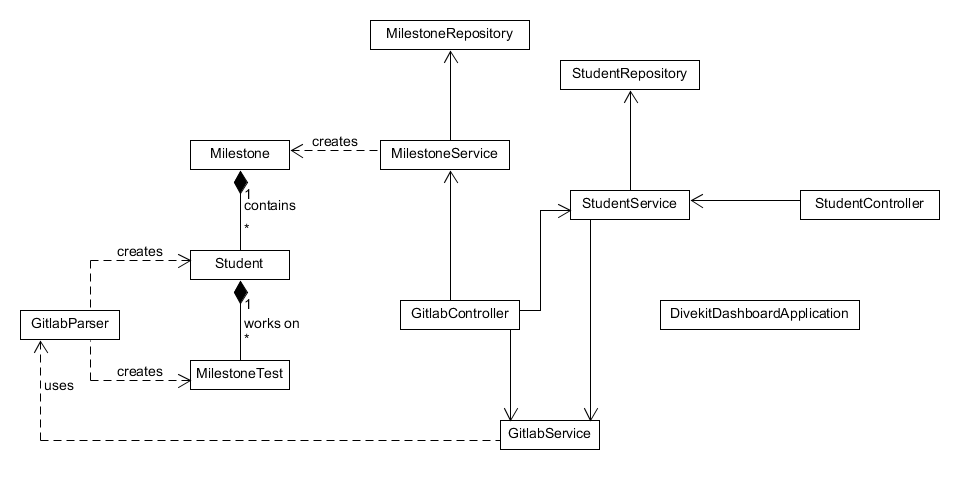

# Divekit-Dashboard

## Setting up the project
You can choose between building the project locally or running it with Docker.

### Option 1: Docker Hub
1. Create and copy personal access token from GitLab. Default is found at
https://git.archi-lab.io/-/user_settings/personal_access_tokens.
2. Download both images for frontend and backend from Docker Hub 
    > docker image pull lzinn/divekit-dashboard:frontend

    > docker image pull lzinn/divekit-dashboard:backend
3. Start frontend
    > docker run -d -p 3000:3000 lzinn/divekit-dashboard:frontend
4. Start backend, setting the GitLab server and GitLab token as environment variables. <var>&lt;GitLab Server URL></var> and <var>&lt;GitLab Token></var> need to be replaced with actual values. 
    > docker run -d -p 8080:8080 -e GITLAB_SERVER=<var>&lt;GitLab Server URL></var> -e GITLAB_TOKEN=<var>&lt;GitLab Token></var>  lzinn/divekit-dashboard:backend
    
    Example: 
    >docker run -d -p 8080:8080 -e GITLAB_SERVER=https://git.archi-lab.io -e GITLAB_TOKEN=1234567890 lzinn/divekit-dashboard:backend
5. Access the site at http://localhost:3000/
### Option 2: Docker Compose 
1. Create and copy personal access token from GitLab. Default is found at
   https://git.archi-lab.io/-/user_settings/personal_access_tokens.
2. Open `.env` in the root folder of the project
3. Set GITLAB_SERVER and GITLAB_TOKEN to your server URL and personal access token
4. Run `docker compose up` in the root folder of the project
5. Access the site at http://localhost:3000/
### Option 3: Build Locally
#### Backend:
1. Create and copy personal access token from GitLab. Default is found at
   https://git.archi-lab.io/-/user_settings/personal_access_tokens.
2. Import Gradle project from
    > /backend/build.gradle
3. Sync Gradle project
4. Edit run configuration to include environment variables `GITLAB_SERVER=` and `GITLAB_TOKEN=` with your server URL
and personal access token 
5. Run application (`DivekitDashboardApplication.java`) or run Gradle task `bootRun`

#### Frontend:
1. Run `yarn install`
2. Run `npm start`
3. Access the site at http://localhost:3000/
 

## Backend Overview

### GitlabController class

Processes REST requests for milestones.

#### REST Endpoints:

| Endpoint                      | Method | Description                                       |
|-------------------------------|--------|---------------------------------------------------|
| /milestones                   | GET    | Returns all milestones.                           |
| /milestones/{id}              | GET    | Returns milestone with the specified ID.          |
| /milestones/sources/**        | POST   | Posts a milestone link.                           |
| /milestones/sources/paths/**  | GET    | Returns the paths of a specific milestone link.   |
| /milestones/refresh           | GET    | Returns all milestones after a refresh.           |
| /milestones/sources           | GET    | Returns all milestone sources.                    |
| /milestones/sources/{id}      | DELETE | Removes all milestones with the specified source. |

### GitlabParser class

Parses the contents from the files on GitLab.

#### Methods
`mdToStudentList`:

- Parses a markdown file (student overview) and returns a list of created students.
- Expected format: List of student data with 4 columns corresponding to:
   - Student username
   - Student repository URL
   - Test repository URL
   - Test overview URL

`htmlToTests`

- Parses the HTML of a test overview page and returns a list of its tests and status.
- Expected format: Test page in current HTML format. Method might require adjustments after updates in test page HTML.

`testsFromGroup`
- Required for htmlToTests, groups the tests to their category (e.g., E01Variables). Method might require adjustments after updates in test page HTML.

### GitlabService class

Responsible for GitLab API calls and reading HTML resources. Requires a GitLab Token.
- Default base URL of the server is https://git.archi-lab.io.
- For a different base URL, assign it to the `GITLAB_SERVER` environment variable.

Methods:

- fetchMilestoneFile: Sends a GET request to GitLab to request all milestone files from an overview repository.
- fetchStudentCommits: Sends a GET request to GitLab to request all commits made by a student for a particular repository. Removes the first commit as it’s auto-generated when creating the repository.
- fetchHtmlString: Opens a URL connection to a student’s test pages to return the HTML as a String.

## Frontend Overview

### Directory Structure

- dashboard: Modules required for the dashboard, the main application.
- chart_modules: Charts for the dashboard based on Nivo charts.
- rest: REST calls to the backend.

### Main Files

- `Dashboard.tsx`: Main file for the dashboard. `<ChartsOverview()>` displays all visible charts.
- `<NavBar>`: Navigation bar for dashboard. Default milestone overview link (in the upper right corner) can be changed 
here or set to empty.
- `chartData.ts`: Functions that return data required for the charts. They get called in the corresponding Nivo charts. 
For new charts, data functions can be added here. See the Nivo documentation to understand what data is expected for
each chart.

### Adding a New Chart:

0. (Optional) Create data function in `chartData.ts`
1. Create a chart module in `chart_modules`
   - Pick a suitable chart from [Nivo charts](https://nivo.rocks/)
   - Copy the chart to the most suitable file in `chart_modules` (or create a new one)
   - Set data source in data of Nivo chart to a data function from `chartData.ts` (e.g., `data={getCommitFrequency(students, true)}`)
   - Adjust parameters of chart (size, format)
2. Add chart module to `ChartsOverview()` in `Dashboard.tsx`

## Architecture

### Backend

- Java 17 with Spring Boot and Gradle
- H2 memory database
- GitLab4J API for working with the GitLab REST API

### Frontend

- TypeScript with React (+HTML/CSS)
- Nivo for charts
- react-spinners for loading bars
- react-toastify for toast messages

### Containerization

Both backend and frontend can be separately containerized with Docker. 
There is a Dockerfile in their respective 
folders (`./backend/Dockerfile` and `./frontend/Dockerfile`). 

There is a Docker Compose file at the root of the project 
(`docker-compose.yml`) to run both of them together. 

Server URL and token can be set via environment variables either 
via the run command or the `.env` file at the root of the project. 

A GitHub action (https://github.com/marketplace/actions/build-and-push-docker-images) automatically builds and
uploads the latest changes to Docker Hub. For this action to work, `DOCKER_USERNAME` and `DOCKER_PASSWORD` need to be 
set as GitHub repository secrets with the credentials of Docker Hub. 

See [how to set up the project](#setting-up-the-project) for more information. 

### Links

- **Spring:** [Spring Documentation](https://docs.spring.io/spring-framework/reference/index.html), [Spring Boot Documentation](https://docs.spring.io/spring-boot/docs/current/reference/htmlsingle/)
- **React:** [React Documentation](https://react.dev/reference/react)
- **Java 17:** [Java 17 API Documentation](https://docs.oracle.com/en/java/javase/17/docs/api/)
- **TypeScript:** [TypeScript Documentation](https://www.typescriptlang.org/docs/)
- **GitLab4J API:** [GitHub Repository](https://github.com/gitlab4j/gitlab4j-api/tree/6.x), [API Documentation](https://javadoc.io/doc/org.gitlab4j/gitlab4j-api/latest/index.html)
- **GitLab REST API documentation:** [GitLab REST API Documentation](https://docs.gitlab.com/ee/api/rest/)
- **Nivo:** [Nivo Charts](https://nivo.rocks/), [Nivo Storybook](https://nivo.rocks/storybook/)
- **react-spinners:** [react-spinners Documentation](https://www.davidhu.io/react-spinners/), [react-spinners Storybook](https://www.davidhu.io/react-spinners/storybook/)
- **react-toastify** [react-toastify Documentation](https://fkhadra.github.io/react-toastify/introduction/)
