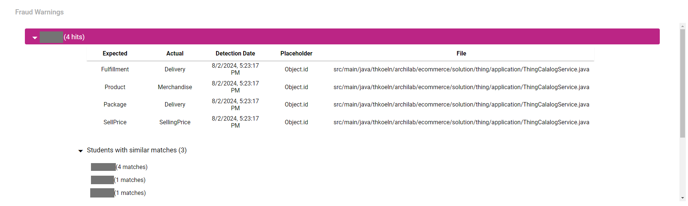

# Divekit-Dashboard

## Setting up the project
You can choose between building the project locally or running it with Docker.

### Docker  
1. Create and copy personal access token from GitLab. Default is found at
   https://git.archi-lab.io/-/user_settings/personal_access_tokens.
2. Open `.env` in the root folder of the project.
3. Set GITLAB_SERVER and GITLAB_TOKEN to your server URL and personal access token.
   - Other values such as the database login and container ports can be optionally changed as well.
4. Run `docker compose up` in the root folder of the project.
5. Access the site at http://localhost:8080/
### Build Locally
#### Backend:
1. Create and copy personal access token from GitLab. Default is found at
   https://git.archi-lab.io/-/user_settings/personal_access_tokens.
2. Import Gradle project from
    > /backend/build.gradle
3. Sync Gradle project
4. [Edit run configuration](https://www.jetbrains.com/help/objc/add-environment-variables-and-program-arguments.html#add-environment-variables) to include environment variables `GITLAB_SERVER=` and `GITLAB_TOKEN=` with your server URL
and personal access token
5. Run application (`DivekitDashboardApplication.java`) or run Gradle task `bootRun`

#### Frontend:
1. Run `yarn install`
2. Run `npm start`
3. Go into `./frontend/src/dashboard/service.ts` and set `BACKEND_URL` to `"http://localhost:8080"`
3. Access the site at http://localhost:3000/
 

### Deployment
1. If there are any code changes in the JPlag report-viewer, go into `./report-viewer` and run `npm run build`. Go into `./report-viewer/dist` and copy
   over all files from that folder into `./frontend/public/report-viewer`.
2. If there are any frontend changes (including the report viewer), also go into the `./frontend` folder and run `npm run build`. Go into
`./frontend/build` and copy over all files from that folder into `./backend/src/main/resources/static`. This lets the backend 
host the frontend of the dashboard.
3. A new docker image can always be build with the included docker-compose and Dockerbuild files. Additionally, a new
docker image is build and uploaded to Dockerhub each time a commit on the official repository is made. 

## Project Overview
Divekit-Dashboard is a web application designed to track and visualize the progress of students through various milestones. 
The application integrates with GitLab repositories to fetch milestone overview files, allowing users to monitor student 
performance via interactive charts.

#### Adding a new milestone overview file
The source for the milestone overview files can be set in the upper right corner. More milestone overview file sources 
can be added after data has been successfully analyzed. 

#### Displaying a specific milestone
By clicking on the dropdown menu on the upper left, a specific milestone can be displayed with the corresponding charts. 

#### Refreshing milestone status
All milestones can be refreshed by clicking the refresh button next to the milestone dropdown menu in the upper left.

#### Managing milestones
Milestones can be managed by clicking the settings button next to the milestone dropdown menu in the upper left. A view
 with all milestones will be displayed. Milestones can be deleted by pressing the trash icon on the right next to the 
name of the corresponding milestone.

### Charts Explanation
#### Commit Bar Chart
Displays a bar chart of the commit frequency distribution among students. The button on the upper right lets the user
copy the chart to clipboard. 

Clicking on part of the bar brings the user to a page of all students who fulfill 
that category (ex.: show all students that are finished).

* Divided into five categories: 
not started, at least one commit, >= 60% of tests done, >= 90% of tests done, finished

#### Commit Pie Chart
Displays a pie chart of commit frequency distribution among students.

Clicking on a part of the pie chart brings the user to a page of all students who fulfill
that category (ex.: show all students that have over 60 commits).

* Divided into multiple categories: 
  0, 1-5, 6-10, 11-20, 21-40, 41-60, 60+ commits

#### Commit Bar Chart
Displays the same information as the commit pie chart in a different chart format.

Clicking on a part of the bar chart brings the user to a page of all students who fulfill
that category (ex.: show all students that have over 60 commits).

* Divided into multiple categories: 
  0, 1-5, 6-10, 11-20, 21-40, 41-60, 60+ commits

#### Student Progress Line Chart
Displays the distribution of student progress. Each point represents the number of students at a specific progress 
percentage.

#### Test Bar Charts
Displays an overview of the test completion status for each group of milestone tests.

Clicking on a part of a test bar chart brings the user to a page of all students who fulfill
that category (ex.: show all students that have not passed e08ManualCheck).

#### Student Table
Displays a table of students with their respective commit counts, first commit date, passed tests, and milestone progress.
Students who have not passed all tests yet are highlighted. 

Clicking on a row in the table opens a sub-view with more information about the respective student 
(see student detail page).

#### Student Detail Page
Displays a detailed view of a respective student. Includes links to repositories and test page, status of tests, 
commit count, commit calendar and timeline.

#### Fraud Detection Warnings
Displays potential fraud attempts by analyzing students using variable names, which are specified in the tasks of other repositories.
Also shows students with matching variable names.

## JPlag
Divekit Dashboard features an integration with the software plagiarism detection software
[JPlag](https://github.com/jplag/JPlag]). Milestone repositories can be analyzed to generate  plagiarism reports.
Reports can be viewed with a local version of the [JPlag Report Viewer](https://jplag.github.io/JPlag/).

All operations can be done from the dashboard.

### Usage
JPlag operations are found in the `JPlag` panel in the upper left corner. The panel lets users manage student repositories,
set JPlag parameters, download JPlag reports and redirect the user to the JPlag report viewer.

### Downloading Repositories
For the JPlag report, copies of the repositories are required. Divekit Dashboard can download the needed repositories
to the backend server. If a previous download of repositories exists, it will be replaced.
1. Select a milestone for the download.
2. Click download.

After a few seconds, the download will be completed and relevant data about the repository size will be shown. The repositories
can be deleted if they are not needed anymore.

### Deleting Repositories
This will irreversibly delete all repositories for the selected milestone. To get the repositories back, another download
is required.

1. Select a milestone to be deleted.
2. Select "Delete Milestone Data".

After a successful delete, a confirmation notification and an update of the repository size will be shown.

### Setting JPlag parameters
JPlag features various settings for configuration. Divekit Dashboard uses the default JPlag settings
with these parameters adjusted:

- Minimum Token Match: 15
- Similarity Threshold: 0.3
- Use Base code?: No

The parameters can be further customized in the panel.
### Creating a JPlag report
This creates a JPlag report by running JPlag on the backend server. The downloaded file is a .zip-archive
compatible with the JPlag report viewer.

1. Select a milestone for the report.
2. Download the repositories if none are downloaded yet.
3. Adjust JPlag Parameters.
4. Decide whether an automatic redirect to the JPlag report viewer should happen.
    - If the download was started from the JPlag Report Viewer, the report will be automatically uploaded to the
      JPlag Report Viewer and displayed.
5. Select "Run JPlag Report".

After a short amount of time, a JPlag report will be generated and downloaded to the user's file system. Depending
on the setting the user will also get redirected to the JPlag Report viewer.

Alternatively, the button
"View JPlag Report Viewer" links to the online version of the report viewer with the latest features. The downloaded file
can be manually uploaded there as well.

## Backend Overview

### GitlabController class

Processes REST requests for milestones.

#### REST Endpoints:

| Endpoint                     | Method | Description                                       |
|------------------------------|--------|---------------------------------------------------|
| /milestones                  | GET    | Returns all milestones.                           |
| /milestones/{id}             | GET    | Returns milestone with the specified ID.          |
| /milestones/sources/**       | POST   | Posts a milestone link.                           |
| /milestones/sources/paths/** | GET    | Returns the paths of a specific milestone link.   |
| /milestones/refresh          | GET    | Returns all milestones after a refresh.           |
| /milestones/sources          | GET    | Returns all milestone sources.                    |
| /milestones/{id}             | DELETE | Removes milestone with the specified ID.          |
| /milestones/sources/{id}     | DELETE | Removes all milestones with the specified source. |

### GitlabParser class

Parses the contents from the files on GitLab.

#### Methods
`mdToStudentList`:

- Parses a markdown file (student overview) and returns a list of created students.
- Expected format: List of student data with 4 columns corresponding to:
   - Student username
   - Student repository URL
   - Test repository URL
   - Test overview URL

`htmlToTests`

- Parses the HTML of a test overview page and returns a list of its tests and status.
- Expected format: Test page in current HTML format. Method might require adjustments after updates in test page HTML.

`testsFromGroup`
- Required for htmlToTests, groups the tests to their category (e.g., E01Variables). Method might require adjustments after updates in test page HTML.

### GitlabService class

Responsible for GitLab API calls and reading HTML resources. Requires a GitLab Token.
- Default base URL of the server is https://git.archi-lab.io.
- For a different base URL, assign it to the `GITLAB_SERVER` environment variable.

Methods:

- fetchMilestoneFile: Sends a GET request to GitLab to request all milestone files from an overview repository.
- fetchStudentCommits: Sends a GET request to GitLab to request all commits made by a student for a particular repository. Removes the first commit as it’s auto-generated when creating the repository.
- fetchHtmlString: Opens a URL connection to a student’s test pages to return the HTML as a String.

### FraudMessageController class

Processes REST requests for fraud messages.

#### REST Endpoints:

| Endpoint                 | Method | Description                                                                                     |
|--------------------------|--------|-------------------------------------------------------------------------------------------------|
| /fraud-messages          | POST   | Saves a fraud message.                                                                          |
| /fraud-messages          | GET    | Returns all fraud messages.                                                                     |
| /fraud-messages/students | GET    | Returns all fraud messages grouped by students.                                                 |
| /fraud-messages/matches  | GET    | Returns a collection of students saved with other students, which have matching fraud warnings. |

### FraudMessageService class

Repsonsible for saving fraud messages, sorting them properly and finding students with matching warnings.

Methods:

- saveFraudMessage: Converts a fraud message string into a FraudMessage object and saves it.
- groupFraudsByStudent: Groups fraud messages by students they belong to into separate lists.
- getFraudMatches: Creates a map, where the keys are students and the values are collections of students with matching fraud warnings. These collections are also Maps, saving potential fraud partners as keys, along with the amount of matches found as values.

## Frontend Overview

### Directory Structure

- dashboard: Modules required for the main application.
  - charts: Charts for the dashboard based on Nivo charts.
  - dashboard-view: Modules for the main dashboard page.
  - settings-view: Modules for the settings page to delete milestones.
  - students-view: Modules for the student detail page when clicking on a specific student.
- rest: REST calls to the backend.
- theme: Sets main colors for the application.

### Main Files

- `Dashboard.tsx`: Main file for the dashboard. `<ChartsOverview()>` displays all visible charts.
- `<NavBar>`: Navigation bar for dashboard. Default milestone overview link (in the upper right corner) can be changed 
here or set to empty.
- `chartData.ts`: Functions that return data required for the charts. Get called in the corresponding Nivo charts. 
For new charts, data functions can be added here. See the Nivo documentation to understand what data is expected for
each chart.

#### Adding a New Chart:

0. (Optional) Create data function in `chartData.ts`
1. Create a chart module in `chart_modules`
   - Pick a suitable chart from [Nivo charts](https://nivo.rocks/)
   - Copy the chart to the most suitable file in `chart_modules` (or create a new one)
   - Set data source in data of Nivo chart to a data function from `chartData.ts` (e.g., `data={getCommitFrequency(students, true)}`)
   - Adjust parameters of chart (size, format)
2. Add chart module to `ChartsOverview()` in `Dashboard.tsx`

## Architecture

### Backend

- Java 21 with Spring Boot and Gradle
- Postgres database
- GitLab4J API for working with the GitLab REST API

#### UML diagram

### Frontend

- TypeScript with React (+HTML/CSS)
- Nivo for charts
- react-spinners for loading bars
- react-toastify for toast messages

### Containerization

Both backend and frontend can be separately containerized with Docker. 
There is a Dockerfile in their respective 
folders (`./backend/Dockerfile` and `./frontend/Dockerfile`). 

There is a Docker Compose file at the root of the project 
(`docker-compose.yml`) to run both of them together. 

Server URL and token can be set via environment variables either 
via the run command or the `.env` file at the root of the project. 

A GitHub action (https://github.com/marketplace/actions/build-and-push-docker-images) automatically builds and
uploads the latest changes to Docker Hub. For this action to work, `DOCKER_USERNAME` and `DOCKER_PASSWORD` need to be 
set as GitHub repository secrets with the credentials of Docker Hub. 

See [how to set up the project](#setting-up-the-project) for more information. 

### Links

- **Spring:** [Spring Documentation](https://docs.spring.io/spring-framework/reference/index.html), [Spring Boot Documentation](https://docs.spring.io/spring-boot/docs/current/reference/htmlsingle/)
- **React:** [React Documentation](https://react.dev/reference/react)
- **Java 17:** [Java 17 API Documentation](https://docs.oracle.com/en/java/javase/17/docs/api/)
- **TypeScript:** [TypeScript Documentation](https://www.typescriptlang.org/docs/)
- **GitLab4J API:** [GitHub Repository](https://github.com/gitlab4j/gitlab4j-api/tree/6.x), [API Documentation](https://javadoc.io/doc/org.gitlab4j/gitlab4j-api/latest/index.html)
- **GitLab REST API documentation:** [GitLab REST API Documentation](https://docs.gitlab.com/ee/api/rest/)
- **Nivo:** [Nivo Charts](https://nivo.rocks/), [Nivo Storybook](https://nivo.rocks/storybook/)
- **react-spinners:** [react-spinners Documentation](https://www.davidhu.io/react-spinners/), [react-spinners Storybook](https://www.davidhu.io/react-spinners/storybook/)
- **react-toastify** [react-toastify Documentation](https://fkhadra.github.io/react-toastify/introduction/)
